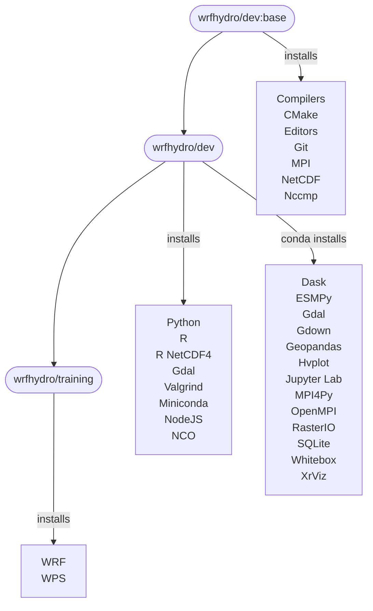
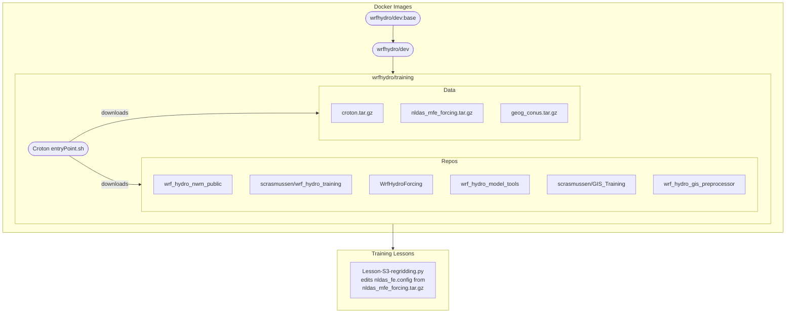

#  WRF-Hydro® Docker Images 

# Description

This repository contains Dockerfiles and associated container contents for [WRF-Hydro](https://github.com/NCAR/wrf_hydro_nwm_public).
These images are available on the [WRF-Hydro Docker Hub page](https://hub.docker.com/u/wrfhydro/).
Large datasets are sometimes required and are avilable on a public Google Drive folder at
[WRF_HYDRO_DOCKER_DATA](https://drive.google.com/open?id=1NY9YdVLcJMIqE6ibLVyKe1fJ-Eoj74Kr).

Each subdirectory in this repository corresponds to a Docker image on the [WRF-Hydro Docker Hub page]
(https://hub.docker.com/u/wrfhydro/).

## Where to get help and/or post issues
If you have general questions about Docker, there are ample online resources including the excellent Docker documentation at https://docs.docker.com/.

The best place ask questions or post issues with these lessons is via the Issues page of the GitHub
repository at https://github.com/NCAR/wrf_hydro_docker/issues.

# Docker Package and Training Charts
## Docker Packages Flowchart

## Training Flowchart

